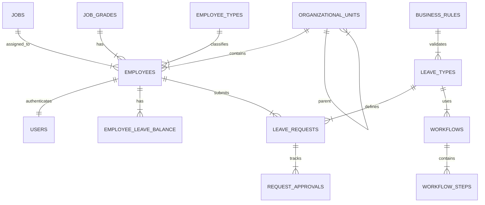

# Suez Canal Authority (SCA) Leave Management System
## Technical Documentation

### 1. Database Schema & ERD

The system is built on Microsoft SQL Server. The schema supports strict relational integrity.

**Enhanced ERD Description:**
*   **users**: Links to `employees` (1:1). Contains `picture_url` for profile icons. Now includes `employee_types`, `job_grades`, and `employee_number`.
*   **employees**: Belongs to `organizational_units`, `jobs`, and `grades`.
*   **organizational_units**: Recursive relationship (`parent_unit_id`) allows infinite hierarchy. Now tracks `manager_id`.
*   **leave_requests**: The core transaction table. Triggers update `employee_leave_balance`.
*   **workflow_engine**: `request_types` link to `workflows` which contain `workflow_steps`. Request lifecycle is tracked in `request_approvals`.

### 2. Frontend Architecture
*   **Framework**: React 18 (TypeScript)
*   **Styling**: Tailwind CSS (Utility-first, RTL native support).
*   **State**: React Context for Auth, Local State for forms.
*   **Charts**: Recharts for Admin KPIs.

### 3. API Integration Strategy
The frontend uses an Axios-based service layer (`/services/api.ts`). Currently mocked, it is designed to be swapped with real endpoints:

*   `POST /api/auth/login` -> Returns JWT + User Object
*   `GET /api/employee/{id}/balances` -> Returns JSON Array
*   `POST /api/leave/request` -> Triggers SQL Stored Procedure `sp_submit_leave_request`

### 4. n8n Automation Workflow
The system supports a 'Hybrid Mode'.
1.  **Manual**: Manager clicks Approve/Reject.
2.  **n8n**:
    *   System sends JSON payload to Webhook.
    *   n8n checks logic (e.g., Is leave > 5 days? Is it 'Sick Leave'?).
    *   If Simple -> n8n calls API to Approve automatically.
    *   If Complex -> n8n marks for Manager Review.

### 5. Enterprise Features (V2 Upgrade)
The V2 schema introduces the following enterprise capabilities:
*   **Advanced Workflows**: Multi-step approvals with role-based routing (e.g., Direct Manager -> HR -> GM).
*   **Career History**: Full tracking of employee promotions, job changes, and grade adjustments.
*   **Audit Logging**: `audit_logs` table captures every INSERT/UPDATE/DELETE action with JSON snapshots of old/new values.
*   **Import Governance**: Dedicated tables to track bulk CSV imports, ensuring traceability of bulk data changes.
*   **Notifications**: Centralized table for persistent in-app user notifications.

### 6. Security Considerations
*   **Input Validation**: Enforced on frontend (Types) and Database (Constraints).
*   **Auth**: Passwords stored as Hashes (BCrypt recommended in backend).
*   **RBAC**: Frontend routes protected by Role checks in `App.tsx`.
